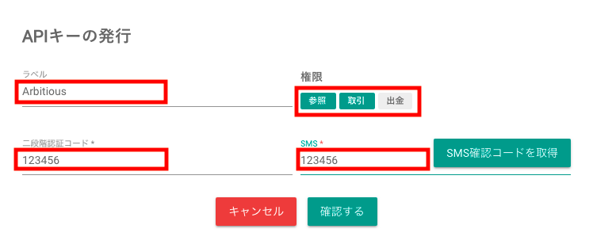
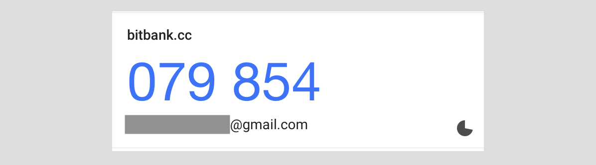
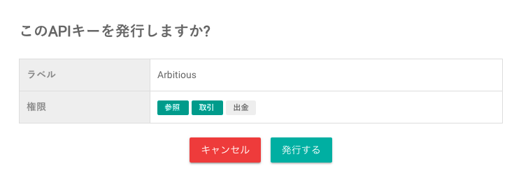
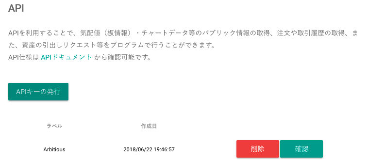
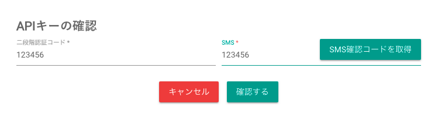
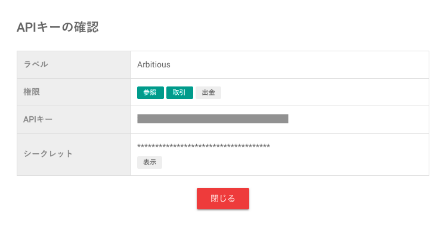
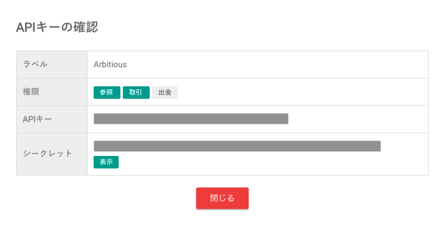

[Arbitious利用マニュアル](../../) ＞ [事前準備](../) ＞ APIキーの取得方法：bitbank

# APIキーの取得方法：bitbank

1. [bitbank](https://www.btcbox.co.jp/user/login/)へログインします。  

1. 右上の人型のボタンを押し、表示メニューから「APIキー」を押します。  

1. APIキー管理画面が表示されるので、「APIキーの発行」を押します。  

1. 必要な情報を入力します。  

    - ラベル：**Arbitious**
    - 権限：「**参照**」と「**取引**」にチェック  
    - 二段階認証コード：XXXXXX(6桁)  
 スマホの二段階認証アプリに表示されるコードを記入  
  
    - SMS：XXXXXX(6桁)  
 隣の「SMS確認コードを取得」ボタンを押して、SMSへ送られたコードを記入  
  

1. ラベルと権限を確認し、「発行する」を押す。

1. ボタンを押すと発行が完了します。

1. 作成したAPIキーが一覧リストに表示されます。  
キーの内容を表示させるには「確認」ボタンを押します。

1. APIキーの確認画面が開きます。二段階認証コードとSMS確認コードを求められるので、それぞれを入力後、「確認」ボタンを押します。

1. 正しいコードが入力されると、画面にAPIキーの値が表示されます。  

1. シークレットの内容は最初は「*」表示になっていますが、「表示」ボタンを押すと見ることができます。

APIキー／シークレットは決して他人に知られないように**厳重に取り扱ってください。**