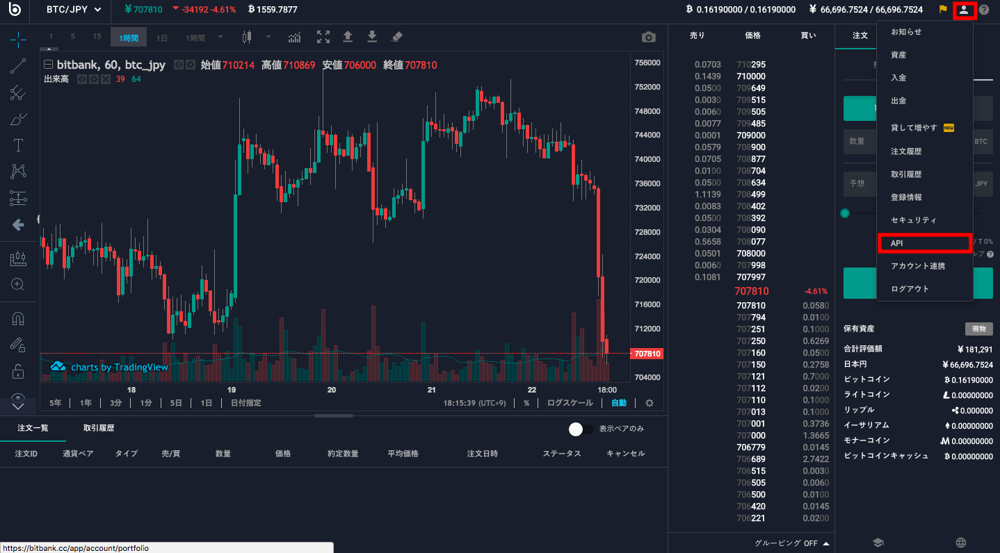
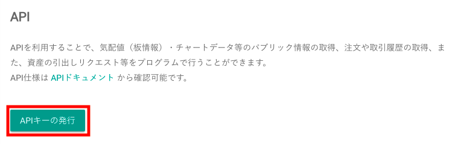

[Arbitious利用マニュアル](../../) ＞ [事前準備](../) ＞ APIキーの取得方法：bitbank

# APIキーの取得方法：bitbank

1. [bitbank](https://www.btcbox.co.jp/user/login/)へログインします。  

1. 右上の人型のボタンを押し、表示メニューから「APIキー」を押す。  

1. APIキー管理画面が表示されるので、「APIキーの発行」を押す  

1. 右上の人型のボタンを押し、表示メニューから「APIキー」を押す。

    - API名称：「**Arbitious**」
    - 権限：**全て権限**
    - 取引パスワード
    - Google2段階認証

1. 公開鍵と秘密鍵がポップアップ表示されます。  
**秘密鍵は一度しか表示されません。厳重に管理してください。**  

1. 秘密鍵を保管後、「確認」を押しポップアップを閉じます。

1. 画面をリフレッシュすると作成したAPIキーが一覧に出ます。  
  
「読み出し」で公開鍵を確認できます。「編集」で権限の変更や、そのAPIキー自体の利用停止が設定できます。